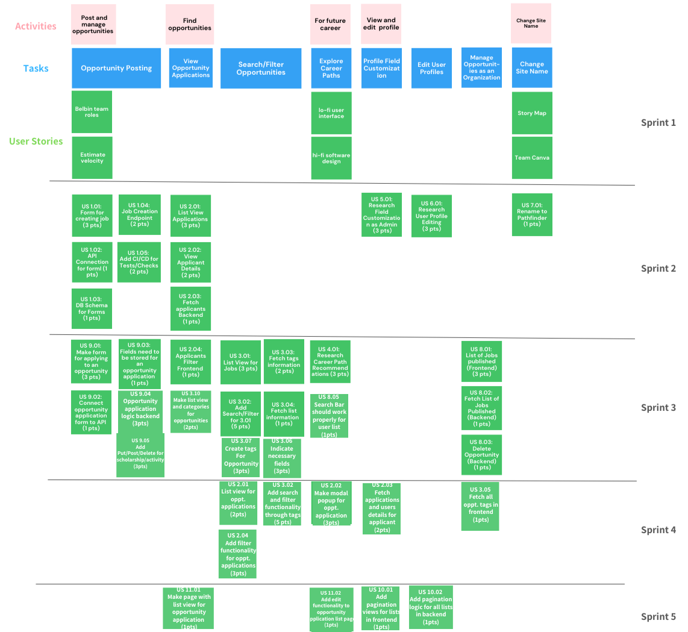

# Project Management

## Story Map

## Project Plan

### Sprint 1

_Due: January 28th_

#### Tasks

| **Task**                                                | **Related US** | **Assigned To** | **Due Date** |
| ------------------------------------------------------- | -------------- | --------------- | ------------ |
| Wireframe - Low-fidelity user interface (Product owner) | Documentation  | Iris            | Jan 28       |
| UML Class/Sequence Diagram (High Fidelity Design)       | Documentation  | Barry           | Jan 28       |
| Estimate Velocity for Sprints 2-5                       | Documentation  | Filipo          | Jan 28       |
| Project Overview and Meeting Minutes                    | Documentation  | John            | Jan 28       |
| Project Plan                                            | Documentation  | Aryan           | Jan 28       |
| Story Map and Team Canvas                               | Documentation  | Hank            | Jan 28       |

### Sprint 2

_Due: February 11th_

#### User stories

| **User story**                       | **Story points** |
| ------------------------------------ | ---------------- |
| SETUP - Setting up dev environment   | 3                |
| US 1.01 - Form for creating job      | 3                |
| US 1.02 - API Connection for form    | 1                |
| US 1.03 - DB Schema for Forms        | 1                |
| US 1.04 - Job Creation Endpoint      | 2                |
| Add self runners for CI/CD           | 2                |
| Fix frontend testing flow            | 3                |
| Update Meeting Minutes for Sprint 2  | 1                |
| Update project overview for Sprint 2 | 1                |
| Update project plan for Sprint 2     | 1                |
| Update story map for Sprint 2        | 1                |
| US 6.01 Research user profile editing| 3                |
| US 7.01 Change site name             | 2                |
| US 5.01 Research field customization | 3                |

Estimated sprint velocity: **27**

#### Tasks

| **Task**                                            | **Related US**                     | **Assigned To** | **Due Date** |
| --------------------------------------------------- | ---------------------------------- | --------------- | ------------ |
| Repo Setup on Local                                 | SETUP - Setting up dev environment | Everyone        | Jan 30       |
| Set Up Form for creating job opportunity (Frontend) | U.S. 1.01                          | Iris            | Feb 7        |
| Design DB Schema for Forms                          | U.S. 1.03                          | Wenhao          | Feb 4        |
| Add Job Creation Endpoint in Django                 | U.S. 1.04                          | Kexun           | Feb 7        |
| Add API Connection with the form in Frontend        | U.S. 1.02                          | Iris            | Feb 9        |
| Add self runners for CI/CD                          | N.A.                               | John            | Feb 4        |
| Fix frontend testing workflow                       | N.A.                               | Aryan           | Feb 10       |
| Update Meeting minutes for Sprint 2                 | N.A                                | John            | Feb 9        |
| Update Project Overview for Sprint 2                | N.A                                | John            | Feb 9        |
| Update Project Plan for Sprint 2                    | N.A                                | Aryan           | Feb 9        |
| Update Story Map for Sprint 2                       | N.A                                | Kexun           | Feb 9        |
| Research User Profile Editing                       | U.S. 6.01                          | Kexun           | Feb 9        |
| Change site name                                    | U.S. 7.01                          | Filipo          | Feb 9        |
| Research Field Customization                        | U.S. 5.01                          | Kexun           | Feb 9        |

### Sprint 3

_Due: March 4th_

#### User stories

| **User story**                        | **Story points** |
| ------------------------------------- | ---------------- |
| US 4.01 - Research on recommendations | 3                |
| US 9.04 - Opport. application backend | 2                |
| US 3.01 - Opportunity List            | 3                |
| US 3.04 - Get All opportunity tags    | 2                |
| US 9.03 - Opport. application fields  | 1                |
| US 9.01 - Application Form            | 3                |
| US 9.02 - Connect Opportunity Applic. | 1                |
| US 8.01 - Current Organization Opport.| 3                |
| US 8.02 - Fetch Opport. List Frontend | 1                |
| US 3.08 - View Details of Users       | 1                |
| US 3.05 - Delete Opportunity Frontend | 2                |
| US 3.06 - Indication-necessary fields | 1                |
| US 3.09 - Edit Opportunity            | 2                |
| US 8.05 - Search Bar for User List    | 1                |
| US 9.05 - Add Put/Post/Delete Backend | 3                |
| US 3.10 - List View, Categories Oppt. | 3                |
| Fix Website Security Bug              | 1                |
| Fix files missing from repo Bug       | 1                |
| Update Meeting Minutes for Sprint 3   | 1                |
| Update Project Overview for Sprint 3  | 1                |
| Update Project Plan for Sprint 3      | 1                |
| Update Story Map for Sprint 3         | 1                |
| Re-estimate Sprint Velocity           | 1                |
| Fix Search Bar bug and alt image tags | 2                |
| Research and Work on Deployment       | 5                |

Estimated sprint velocity: **40**

#### Tasks

| **Task**                                            | **Related US**                     | **Assigned To** | **Due Date** |
| --------------------------------------------------- | ---------------------------------- | --------------- | ------------ |
| Fetch Opportunity list in frontend                  | U.S. 8.02                          | Iris            | Feb 22       |
| Research on career path recommendations             | U.S. 4.01                          | Wenhao          | Feb 25       |
| Opportunity application Fields DB                   | U.S. 9.03                          | Wenhao          | Feb 20       |
| Delete Opportunity Frontend                         | U.S. 3.05                          | Iris            | Feb 22       |
| Opportunity application logic backend               | U.S. 9.04                          | Kexun           | Feb 20       |
| Add Put/Post/Delete for scholarship/activity        | U.S. 9.05                          | Iris            | Feb 28       |
| Application Form (Frontend)                         | U.S. 9.01                          | John            | Feb 25       |
| Create Modal view for user details                  | U.S. 3.08                          | Iris            | Feb 28       |
| List of opportunities                               | U.S. 3.01                          | Iris            | Feb 22       |
| Connect Opportunity application form to API         | U.S. 9.02                          | John            | Feb 25       |
| Get endpoint to get all opportunity tags            | U.S. 3.04                          | Aryan           | Feb 25       |
| Indicate necessary fields                           | U.S. 3.06                          | Iris            | Feb 20       |
| Edit Opportunity                                    | U.S. 3.09                          | Iris            | Mar 01       |
| Make list view and categories for opportunities     | U.S. 3.10                          | Filippo         | Mar 02       |
| Fix Website Security Bug                            | N.A.                               | Iris            | Mar 01       |
| Fix missing files from Repo Bug                     | N.A.                               | John            | Mar 01       |
| Search Bar should work properly for user list       | U.S. 8.05                          | Iris            | Mar 02       |
| Update Meeting Minutes for Sprint 3                 | N.A.                               | John            | Mar 04       |
| Update Project Plan for Sprint 3                    | N.A.                               | Aryan           | Mar 04       |
| Update Project Overview for Sprint 3                | N.A.                               | John            | Mar 04       |
| Display current organization's opportunities        | U.S. 8.01                          | Iris            | Feb 28       |
| Re-estimate Sprint Velocity                         | N.A.                               | Filippo         | Mar 04       |
| Update Story Map for Sprint 3                       | N.A.                               | Wenhao          | Mar 04       |
| Fix Search Bar bug and alt image tags               | N.A.                               | Filippo         | Mar 01       |
| Research and Work on Deployment                     | N.A.                               | Aryan           | Mar 04       |

### Sprint 4

_Due: March 18th_

#### User stories

| **User story**                                   | **Story points** |
| ------------------------------------------------ | ---------------- |
| US 2.01 List View for Oppt. Applications         | 3                |
| US 2.04 Filter for Oppt. Applications            | 2                |
| US 2.02 Make page/popup for oppt. application    | 2                |
| US 2.03 Fetch applications, user details         | 1                |
| US 10.01 Add Pagination Logic in Backend         | 2                |
| US 10.02 Add Pagination Logic in Frontend        | 3                |
| Update Meeting Minutes for Sprint 4              | 1                |
| Update Project Overview for Sprint 4             | 1                |
| Update Project Plan for Sprint 4                 | 1                |
| Update Story Map for Sprint 4                    | 1                |
| Update Github Issues for Sprint 5                | 1                |
| Re-estimate Sprint Velocity                      | 1                |
| Fix broken company view page (BUG)               | 1                |
| Remove Old Opportunity Implementation            | 3                |
| Update GET Opportunity endpoint for Auth. Users  | 2                |
| Endpoint to check if a user has applied or not   | 2                |
| Update Job endpoint to be consistent             | 2                |
| Fix Broken company user id                       | 1                |
| Post Data without ID                             | 2                |
| Fix Opportunity Backend                          | 2                |
| US 11.01 Display All Company Opportunities       | 3                |
| Create Figma Prototype                           | 1                |
| Fix API Image in docs                            | 1                |
| Fix hardcoded baseUrl                            | 1                |
| US 11.04 Display All oppts in the dashboard      | 2                |

Estimated sprint velocity: **42**

#### Tasks

| **Task** | **Related US** | **Assigned To** | **Due Date** |
| --------------------------------------------------- | ---------------------------------- | --------------- | ------------ |
| List view for oppt. applications                    | U.S. 2.01                          | Iris            | Mar 11       |
| Add filter functionality for oppt. applications     | U.S. 2.04                          | Iris            | Mar 15       |
| Make modal popup for oppt. application              | U.S. 2.02                          | Iris            | Mar 12       |
| Fetch applications and users details for applicant  | U.S. 2.03                          | Iris            | Mar 8        |
| Add Pagination for Lists (Backend)                  | U.S. 10.01                         | Aryan           | Mar 15       |
| Add Pagination for Lists (Frontend)                 | U.S. 10.02                         | Aryan           | Mar 18       |
| Fix broken company view page (BUG)                  | N.A.                               | Filippo         | Mar 15       |
| Remove Old Opportunity Implementation               | N.A.                               | Filippo         | Mar 18       |
| Update GET Opportunity endpoint for Auth. Users     | N.A.                               | John, Barry     | Mar 10       |
| Endpoint to check if a user has applied or not      | N.A.                               | Barry           | Mar 17       |
| Modify Endpoints to Return Full Company Object      | N.A.                               | Barry           | Mar 18       |
| Update Job endpoint to be consistent                | N.A.                               | Iris            | Mar 15       |
| Fix Broken company user id                          | N.A.                               | Iris            | Mar 10       |
| Post Data without ID                                | N.A.                               | Iris            | Mar 18       |
| Fix Opportunity Backend                             | N.A.                               | Iris            | Mar 16       |
| Display All Company Opportunities                   | U.S. 11.01                         | John            | Mar 14       |
| Create Figma Prototype                              | N.A.                               | Hank            | Mar 18       |
| Add delete function to oppt application list page   | U.S. 11.03                         | John            | Mar 17       |
| Fix API Image in DOCS                               | N.A.                               | John            | Mar 18       |
| Fix hardcoded baseURL                               | N.A.                               | John            | Mar 12       |
| Display All oppts in the dashboard                  | U.S. 11.04                         | Iris            | Mar 18       |
| Update Github Issues for Sprint 5                   | N.A.                               | John            | Mar 18       |
| Update Story Map for Sprint 5                       | N.A.                               | Hank            | Mar 18       |
| Update Project Plan for Sprint 5                    | N.A.                               | Aryan           | Mar 18       |
| Update Meeting Minutes for Sprint 5                 | N.A.                               | John            | Mar 18       |
| Update Project Overview for Sprint 5                | N.A.                               | John            | Mar 18       |
| Re-estimate Sprint Velocity                         | N.A.                               | Filippo         | Mar 18       |

### Sprint 5

_Due: April 4th_

#### User stories

| **User story**                                   | **Story points** |
| US 3.02 Add Search/Filter Tag functionality      | 5                |
| Make Slideshow Presentation                      | 5                |
| Create Screencast                                | 3                |
| US 11.02 Edit functionality for oppt. application| 2                |
| Submit Info for 401 portal                       | 1                |
| Improve Testing                                  | 5                |
| Update Deployment for Production                 | 3                |
| Update API docs for Sprint 5                     | 1                |
| Update Scrum Roles for Sprint 5                  | 1                |
| Create Job Description                           | 2                |
| Create User Manual                               | 5                |
| Create Deployment Instructions for Sprint 5      | 3                |
| Refactor Navigation Bar                          | 2                |
| Fix text across the project                      | 2                |
| Change edit button on profile button to back but.| 1                |

Estimated sprint velocity: **41**

#### Tasks

| **Task** | **Related US** | **Assigned To** | **Due Date** |
| --------------------------------------------------- | ---------------------------------- | --------------- | ------------ |
| Add Search/Filter Tag functionality                 | U.S. 3.02                          | Aryan           | Mar 25       |
| Make Slideshow Presentation                         | N.A.                               | Everyone        | Mar 30       |
| Create Screencast for presentation                  | N.A.                               | John            | Mar 30       |
| Edit functionality for oppt. application list page  | U.S. 11.02                         | Iris            | Mar 27       |
| Submit Info for 401 portal                          | N.A.                               | Filippo         | Apr 1        |
| Improve Testing                                     | N.A.                               | Barry           | Mar 27       |
| Update Deployment for Production                    | N.A.                               | Hank            | Mar 30       |
| Update API docs for Sprint 5                        | N.A.                               | John            | Mar 28       |
| Update Scrum Roles for Sprint 5                     | N.A.                               | Iris            | Mar 20       |
| Create Job Description                              | N.A.                               | Aryan           | Mar 30       |
| Create User Manual                                  | N.A.                               | Barry           | Apr 1        |
| Create Deployment Instructions for Sprint 5         | N.A.                               | Aryan           | Apr 1        |
| Refactor Navigation Bar                             | N.A.                               | Iris            | Mar 27       |
| Fix text across the project                         | N.A.                               | John            | Mar 27       |
| Change edit button on profile button to back but.   | N.A.                               | Hank            | Mar 27       |

