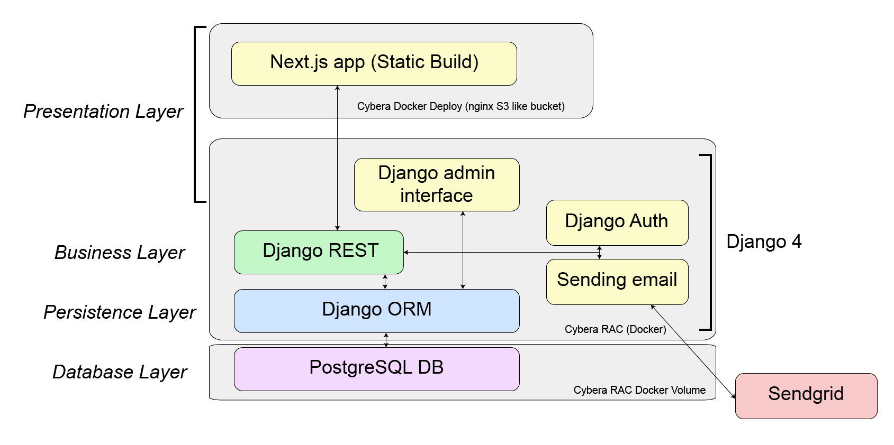

# Software Design

This page includes a short description of the overall architecture style of the system, its high-level system components, and their logical (what data they exchange) and control (how they invoke each other) dependencies. Mostly described using diagrams.

## Architecture Diagram

A NextJS-Django stack built on Docker and hosted on Cybera. The frontend will be statically built, the django server will be running on a separate container. The server will be running the business and persistence layers. The DB is postgres and will be a docker volume attached to the Django container. In addition emails will be sent through [Sendgrid](https://sendgrid.com/). The frontend will communicate with the backend using REST in JSON (header + body) format.

## UML Class Diagram

This is an ER diagram of the app. There are two main types of accounts, Admin and User. User can follow 0 or many companies. They also have attributes attached to the user and can be extended upon like a mentor. Users can also have badges. Admin manages users, activities and scholarships.

## Sequence Diagrams

Multiple sequence diagrams depicting the most important scenarios. There is a diagram for each major user: Organizations, Young Person and Admin.

## Low-Fidelity User interface

Low-fidelity wireframe of the initial concept. The first image is the landing page. The next is the actual platform where users can use the app to navigate and explore all sorts of items/events.

## Figma Prototype User interface

<iframe style="border: 1px solid rgba(0, 0, 0, 0.1);" width="800" height="450" src="https://www.figma.com/embed?embed_host=share&url=https%3A%2F%2Fwww.figma.com%2Fproto%2F5oIdurKU3NaKUemrhJ0KvA%2FNew-Prototype%3Fpage-id%3D0%253A1%26node-id%3D1-31%26viewport%3D-55%252C120%252C0.32%26scaling%3Dscale-down%26starting-point-node-id%3D1%253A31" allowfullscreen></iframe>

# API Documentation

API documentation is available at [http://[2605:fd00:4:1001:f816:3eff:fe0d:f6c0]:8000/docs/](http://[2605:fd00:4:1001:f816:3eff:fe0d:f6c0]:8000/docs/). Screenshots of the documentation are also included below.

## Technology List

### Backend

#### Django

High level Python web framework: https://www.djangoproject.com/

#### django rest framework

Toolkit for building Web APIs in django. Also provides api test functionality.: https://www.django-rest-framework.org/

#### djoser

Provides a set of Django Rest Framework views to handle basic authentication actions: https://pypi.org/project/djoser/

#### Sendgrid

Email delivery platform: https://sendgrid.com/

#### Swagger

Provides tools for API documentation: https://swagger.io/

---

### Database

#### SQLite

Lightweight database that is suitable for development: https://www.sqlite.org/index.html

#### PostgreSQL

Powerful, open source object-relational database system, suitable for production: https://www.postgresql.org/

---

### Frontend

#### Tailwind

Tailwind is a class based css framework: https://tailwindcss.com/

#### Jest

Jest is a testing framework for the frontend: https://jestjs.io/

#### Cypress

Cypress is an e2e testing framework: https://www.cypress.io/

#### NextJS

A react framework meant to be SSR but has options for static builds: https://nextjs.org/

---

### Deployment

#### Cybera

Not-for-profit corporation responsible for the operation of Alberta's Optical Regional Advanced Network: https://www.cybera.ca/

---

### DevOps

#### Docker

Docker is an container application to isolate and deploy applications: https://www.docker.com/

#### Docker compose

Extends Docker for running multi-container applications: https://docs.docker.com/compose/

#### traefik

Manages container networks: https://traefik.io/
