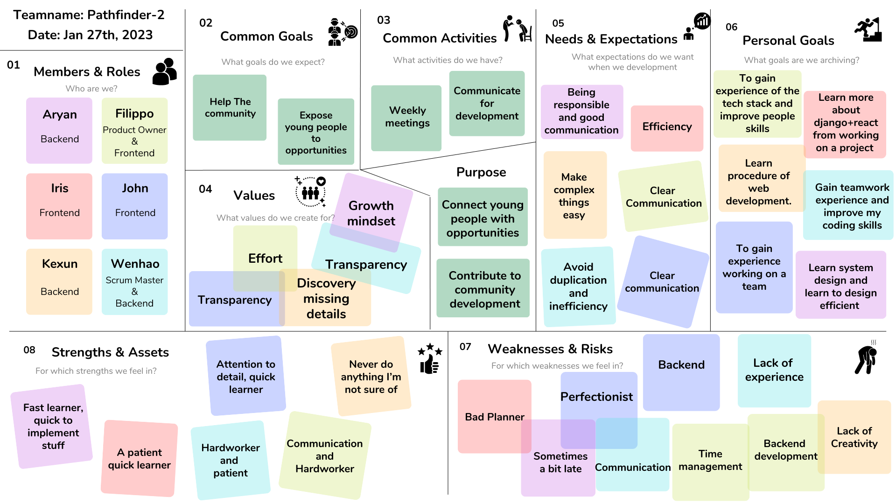

# Teamwork

This page provides an overview of the team and its members.

## Team Canvas

## Belbin Roles

**Source:** <https://www.belbin.com/about/belbin-team-roles>

| Name           | Preferred Roles | Manageable Roles | Least Preferred Roles |
| -------------- | --------------- | ---------------- | --------------------- |
| Aryan Kalwani  | SP, PL, CF      | IMP, RI, TW      | CO, SH, ME            |
| Filippo Ciandy | TW, CO, SH      | PL, IMP, ME      | SP, CF, RI            |
| Iris Du        | TW, IMP, CO     | PL, SP, RI       | CF, SH, ME            |
| John Goodliff  | IMP, CF, SP     | ME, SH, TW       | RI, CO, PL            |
| Kexun Niu      | TW, SH, SP      | CF, RI, IMP      | CO, ME, PL            |
| Wenhao Cao     | TW, IMP, PL     | CF, ME, SH       | SP, RI, CO            |

| Sprint   | Scrum Master | Product Owner  |
| -------- | ------------ | -------------- |
| Sprint 1 | Wenhao Cao   | Filippo Ciandy |
| Sprint 2 | John Goodliff| Filippo Ciandy |
| Sprint 3 | Iris Du      | Kexun Niu      |
| Sprint 4 | John Goodliff| Aryan Kalwani  |
| Sprint 5 | ??           | ??             |

### Thinking Roles

#### PL (Plant)

> Tends to be highly creative and good at solving problems in unconventional ways.

1. Wenhao Cao (Preferred)
2. Aryan Kalwani (Preferred)
3. Filippo Ciandy (Manageable)
4. Iris Du (Manageable)

#### ME (Monitor Evaluator)

> Provides a logical eye, making impartial judgements where required and weighs up the team's options in a dispassionate way.

1. Filippo Ciandy (Manageable)
2. John Goodliff (Manageable)
3. Wenhao Cao (Manageable)

#### SP (Specialist)

> Brings in-depth knowledge of a key area to the team.

1. John Goodliff (Preferred)
2. Aryan Kalwani (Preferred)
3. Iris Du (Manageable)

### Action Roles

#### SH (Shaper)

> Provides the necessary drive to ensure that the team keeps moving and does not lose focus or momentum.

1. Filippo Ciandy (Preferred)
2. John Goodliff (Manageable)

#### IMP (Implementer)

> Needed to plan a workable strategy and carry it out as efficiently as possible.

1.  John Goodliff (Preferred)
2.  Wenhao Cao (Preferred)
3.  Kexun Niu (Preferred)
4.  Aryan Kalwani (Manageable)
5.  Filippo Ciandy (Manageable)
6.  Iris Du (Preferred)

#### CF (Completer Finisher)

> effectively used at the end of tasks to polish and scrutinize the work for errors, subjecting it to the highest standards of quality control.

1.  John Goodliff (Preferred)
2.  Wenhao Cao (Manageable)
3.  Aryan Kalwani (Preferred)

### People Roles

#### RI (Resource Investigator)

> Uses their inquisitive nature to find ideas to bring back to the team.

1. Aryan Kalwani (Manageable)
2. Iris Du (Manageable)
2. Kexun Niu (Preferred)

#### TW (Teamworker)

> Helps the team to gel, using their versatility to identify the work required and complete it on behalf of the team.

1. Kexun Niu (Manageable)
2. John Goodliff (Manageable)
3. Aryan Kalwani (Manageable)
4. Filippo Ciandy (Preferred)
5. Iris Du (Preferred)

#### CO (Co-ordinator)

>Needed to focus on the team's objectives, draw out team members and delegate work appropriately.

1. Filippo Ciandy (Preferred)
2. Iris Du (Preferred)
